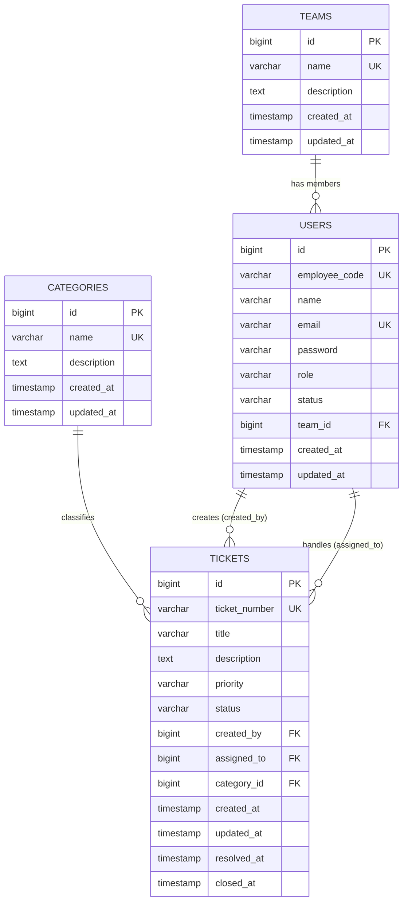

# DeskFlow: Internal Helpdesk

DeskFlow is an internal helpdesk and ticketing platform designed to streamline support operations. The platform triages, routes, and assists agents to resolve tickets against SLAs in record time.

---

## Database Entity-Relationship Diagram (ERD)

Below is the entity-relationship model representing the database schema. It consists of four core tables: `teams`, `categories`, `users`, and `tickets`.



### Table Details
1. **Teams (`teams`)**: Organizes users into specific departments (e.g., Support, Engineering).
2. **Categories (`categories`)**: Categorizes tickets to enable correct routing (e.g., Network, Hardware).
3. **Users (`users`)**: Represents all registered employees, agents, and admins.
4. **Tickets (`tickets`)**: Tracks support issues, priority, state transitions, assignees, and resolution timestamps.

---

## Getting Started

### Prerequisites
* **Java 21**
* **PostgreSQL** running locally on port `5432` with a database named `deskflow` (username: `postgres`, password: `postgres`).

### Running Locally
To run the backend service and execute migrations:

1. Navigate to the `backend` directory:
   ```bash
   cd backend
   ```

2. Run the application using the Maven Wrapper:
   ```bash
   # On Windows
   .\mvnw.cmd spring-boot:run

   # On Linux/macOS
   ./mvnw spring-boot:run
   ```
