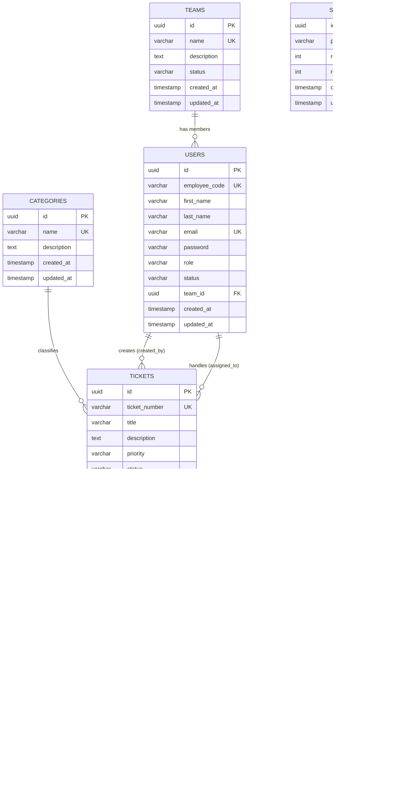

# DeskFlow: Internal Helpdesk

DeskFlow is an internal helpdesk and ticketing platform designed to streamline support operations. The platform triages, routes, and assists agents to resolve tickets against SLAs in record time.

---

## Database Entity-Relationship Diagram (ERD)


Below is the entity-relationship model representing the database schema. It consists of five core tables: `teams`, `categories`, `users`, `tickets`, and `ticket_attachments`.
Below is the entity-relationship model representing the database schema. It consists of four core tables: `teams`, `categories`, `users`, and `tickets`.



### Table Details
1. **Teams (`teams`)**: Organizes users into specific departments (e.g., Support, Engineering).
2. **Categories (`categories`)**: Categorizes tickets to enable correct routing (e.g., Network, Hardware).
3. **Users (`users`)**: Represents all registered employees, agents, and admins.
4. **Tickets (`tickets`)**: Tracks support issues, priority, state transitions, assignees, and resolution timestamps.
5. **Ticket Attachments (`ticket_attachments`)**: Stores S3 file attachment metadata linked to tickets.

---

## Getting Started

### Prerequisites
* **Java 21**
* **PostgreSQL** running locally on port `5432` with a database named `deskflow` (username: `postgres`, password: `postgres`).

### Running Locally
To run the backend service and execute migrations:

1. Navigate to the `backend` directory:
   ```bash
   cd backend
   ```

2. Run the application using the Maven Wrapper:
   ```bash
   # On Windows
   .\mvnw.cmd spring-boot:run

   # On Linux/macOS
   ./mvnw spring-boot:run
   ```

---

## API Documentation & Endpoint Reference

### Ticket Management APIs (`/api/v1/tickets`)

| Method | Endpoint | Description | Query Parameters / Path Variables |
| :--- | :--- | :--- | :--- |
| **POST** | `/api/v1/tickets` | Create a new ticket with input validation | None (JSON Body required) |
| **GET** | `/api/v1/tickets/{id}` | Get detailed information of a ticket by UUID | `id` (Path variable) |
| **PUT** | `/api/v1/tickets/{id}` | Update an existing ticket (supports partial updates) | `id` (Path variable), JSON Body |
| **GET** | `/api/v1/tickets` | List tickets with pagination, sorting, and filters | `page`, `size`, `status`, `priority`, `category`, `assignee`, `sortBy`, `sortDir` |
| Method | Endpoint | Description | Query Parameters / Content-Type |
| :--- | :--- | :--- | :--- |
| **POST** | `/api/v1/tickets` | Create a new ticket with optional file attachments (AWS S3) | `multipart/form-data` (`ticket` JSON string + optional `files` array) |
| **GET** | `/api/v1/tickets/{id}` | Get detailed information of a ticket by UUID (returns 60-min pre-signed S3 URLs) | `id` (Path variable) |
| **PUT** | `/api/v1/tickets/{id}` | Update an existing ticket (supports status transitions & `reopenCount`) | `id` (Path variable), JSON Body |
| **GET** | `/api/v1/tickets` | List tickets with pagination, timeline sorting, multi-field search, and filters | `page`, `size`, `search`, `status`, `priority`, `category`, `assignee`, `sortBy`, `sortDir` |


---

### Interactive Swagger UI

The project features fully integrated OpenAPI 3/Swagger documentation conforming to enterprise developer standards. When the application is running locally, you can access:

* **Interactive Swagger UI**: [http://localhost:8080/swagger-ui/index.html](http://localhost:8080/swagger-ui/index.html) — used to view, explore, and trigger REST API endpoints directly from your browser.
* **Raw OpenAPI JSON Specs**: [http://localhost:8080/v3/api-docs](http://localhost:8080/v3/api-docs) — raw OpenAPI 3.0 specification definition.


=======

