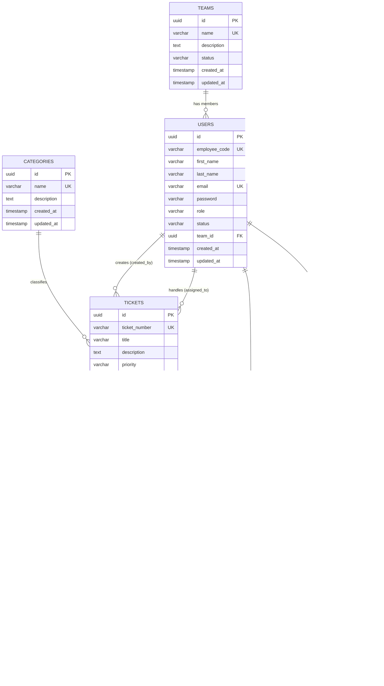

# DeskFlow: Java Backend Application

DeskFlow is the core Java Spring Boot service for the internal helpdesk platform. It provides JWT-secured APIs for managing customer support tickets, enforcing workflow state machine transitions, logging audit activities, and handling S3 file attachments.

---

## Getting Started

### Prerequisites
- **Java 21**
- **PostgreSQL** — accessible via `DB_URL`, `DB_USERNAME`, `DB_PASSWORD` environment variables
- **Environment variables** — copy `.env.example` to `.env` and fill in values

### Required Environment Variables

| Variable | Description |
|---|---|
| `DB_URL` | JDBC connection string |
| `DB_USERNAME` | Database username |
| `DB_PASSWORD` | Database password |
| `JWT_SECRET` | 256-bit hex-encoded HMAC key (64 hex chars) |
| `JWT_EXPIRATION_MS` | Token validity in milliseconds |
| `AWS_S3_BUCKET` | S3 bucket name for attachments |
| `AWS_REGION` | AWS region |
| `AWS_ACCESS_KEY_ID` | AWS access key |
| `AWS_SECRET_ACCESS_KEY` | AWS secret key |
| `CORS_ALLOWED_ORIGINS` | Comma-separated list of allowed frontend origins |

### Running Locally

```bash
# Windows
.\mvnw.cmd spring-boot:run

# Linux / macOS
./mvnw spring-boot:run
```

---

## Authentication

All endpoints (except login) require a valid **Bearer JWT** in the `Authorization` header.

**Flow:**
1. Call `POST /api/v1/auth/login` with email and password
2. Copy the `token` from the response
3. Add `Authorization: Bearer <token>` to all subsequent requests

See **[JWT_AUTH.md](JWT_AUTH.md)** for the full authentication and authorization guide.

---

## Role-Based Access

| Role | Description |
|---|---|
| `EMPLOYEE` | Raises tickets, views only their own tickets, adds comments |
| `AGENT` | Updates and resolves tickets, views all tickets, adds comments |
| `ADMIN` | Registers users, views all data, updates tickets |

> Users cannot self-register. Only an ADMIN can create accounts via `POST /api/v1/auth/register`.

---

## Database Entity-Relationship Diagram (ERD)



---

## API Endpoint Reference

### Authentication APIs (`/api/v1/auth`)

| Method | Endpoint | Auth Required | Role | Description |
|:---|:---|:---:|:---:|:---|
| **POST** | `/api/v1/auth/login` | No | All | Authenticate and receive a JWT |
| **POST** | `/api/v1/auth/register` | Yes | ADMIN only | Create a new EMPLOYEE or AGENT account |

**Login request body:**
```json
{
  "email": "<user@example.com>",
  "password": "<password>"
}
```

**Register request body:**
```json
{
  "firstName": "<first-name>",
  "lastName": "<last-name>",
  "email": "<user@example.com>",
  "password": "<password>",
  "role": "<EMPLOYEE|AGENT|ADMIN>",
  "employeeCode": "<optional>",
  "teamId": "<optional-team-uuid>"
}
```

---

### Category APIs (`/api/v1/categories`)

| Method | Endpoint | Auth Required | Role | Description |
|:---|:---|:---:|:---:|:---|
| **GET** | `/api/v1/categories` | Yes | All | Fetch all ticket categories |

Use the returned `id` values when creating tickets. Available category types: `TECHNICAL`, `BILLING`, `ACCOUNT_ACCESS`, `FEATURE_REQUEST`, `GENERAL`.

---

### Ticket Core & Attachments APIs (`/api/v1/tickets`)

| Method | Endpoint | Auth Required | Role | Description |
|:---|:---|:---:|:---:|:---|
| **POST** | `/api/v1/tickets` | Yes | EMPLOYEE | Create a ticket (JSON body) |
| **POST** | `/api/v1/tickets` | Yes | EMPLOYEE | Create a ticket with attachments (multipart/form-data) |
| **GET** | `/api/v1/tickets/{id}` | Yes | All | Get a ticket by UUID — EMPLOYEE sees only their own |
| **PUT** | `/api/v1/tickets/{id}` | Yes | AGENT, ADMIN | Update ticket (status, assignee, category, etc.) |
| **GET** | `/api/v1/tickets` | Yes | All | List tickets — EMPLOYEE sees only their own; AGENT/ADMIN see all |

**Create ticket request body:**
```json
{
  "title": "<ticket-title>",
  "description": "<ticket-description>",
  "priority": "<LOW|MEDIUM|HIGH|URGENT>",
  "categoryId": "<category-uuid>"
}
```

> `createdBy` is **not** required in the request body — it is resolved automatically from the JWT.

**Query parameters for listing tickets:**

| Parameter | Default | Description |
|---|---|---|
| `page` | `0` | Zero-indexed page number |
| `size` | `10` | Records per page |
| `status` | — | Filter: `OPEN`, `TRIAGED`, `IN_PROGRESS`, `ON_HOLD`, `RESOLVED`, `CLOSED` |
| `priority` | — | Filter: `LOW`, `MEDIUM`, `HIGH`, `URGENT` |
| `category` | — | Filter by category UUID |
| `assignee` | — | Filter by assignee UUID |
| `search` | — | Free-text search across title, description, ticket number |
| `sortBy` | `createdAt` | Sort field |
| `sortDir` | `desc` | `asc` or `desc` |

**Valid status transitions:**

| From | Allowed |
|---|---|
| `OPEN` | `TRIAGED`, `IN_PROGRESS`, `CLOSED` |
| `TRIAGED` | `IN_PROGRESS`, `ON_HOLD`, `CLOSED` |
| `IN_PROGRESS` | `ON_HOLD`, `RESOLVED`, `CLOSED` |
| `ON_HOLD` | `IN_PROGRESS`, `CLOSED` |
| `RESOLVED` | `CLOSED`, `OPEN`, `IN_PROGRESS` |
| `CLOSED` | `OPEN`, `IN_PROGRESS` |

---

### Ticket Comments & Audit Activity APIs (`/api/v1/tickets/{ticketId}/...`)

| Method | Endpoint | Auth Required | Role | Description |
|:---|:---|:---:|:---:|:---|
| **POST** | `/api/v1/tickets/{ticketId}/comments` | Yes | All | Post a top-level comment or threaded reply (`@mention` supported) |
| **GET** | `/api/v1/tickets/{ticketId}/comments` | Yes | All | Retrieve threaded comments and nested replies |
| **GET** | `/api/v1/tickets/{ticketId}/activities` | Yes | All | Retrieve chronological state transition audit log |

---

## Interactive API Documentation

When the application is running:

- **Swagger UI:** [http://localhost:8080/swagger-ui/index.html](http://localhost:8080/swagger-ui/index.html)
- **OpenAPI JSON:** [http://localhost:8080/v3/api-docs](http://localhost:8080/v3/api-docs)

To authenticate in Swagger UI:
1. Call `POST /api/v1/auth/login` and copy the `token`
2. Click **Authorize** at the top of the page
3. Enter the token value and click Authorize
4. All subsequent requests will include the token automatically
